# Домашнее задание к занятию 11 «Teamcity»

---

## 1. Виртуальные машины в Yandex Cloud
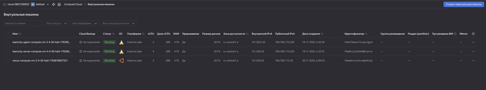
- Три ВМ: TeamCity Server, TeamCity Agent, Nexus.
- Все сервера находятся в одной зоне доступности.

---

## 2. Nexus Repository Manager
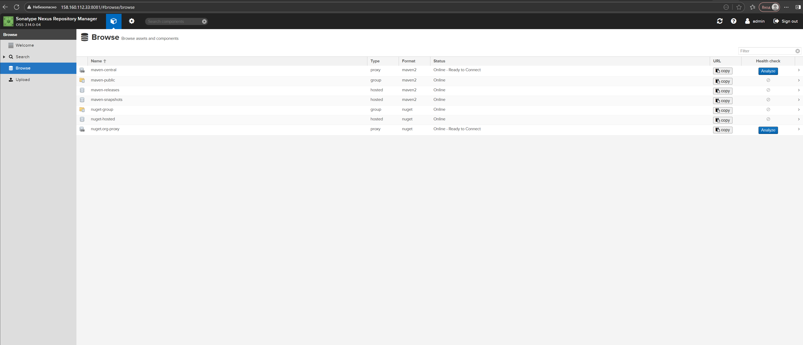
- Репозитории `maven-releases`, `maven-snapshots`, `maven-public` настроены.

---

## 3. Сборка TeamCity: `clean test`
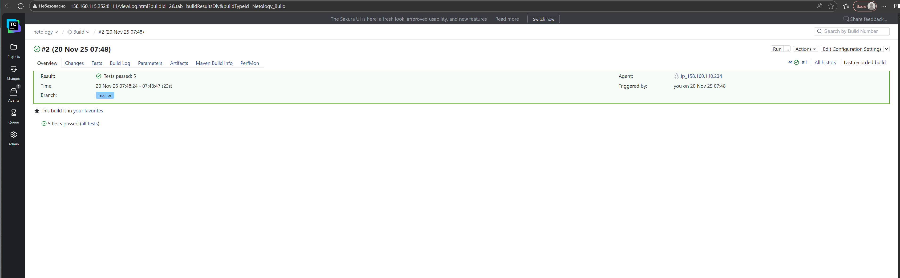
- Первая успешная сборка.
- Запускал только `clean test`.

---

## 4. Логи сборки `clean test`
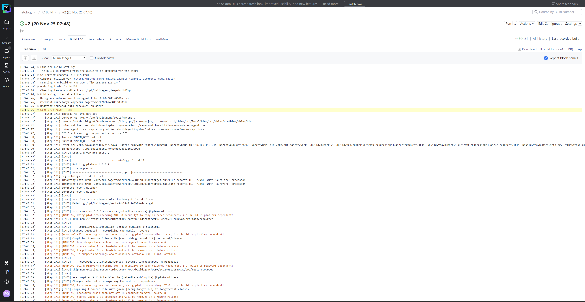
- Тесты выполняются.
- Артефакты ещё не собираются.

---

## 5. Сборка `clean deploy` + загрузка `settings.xml`
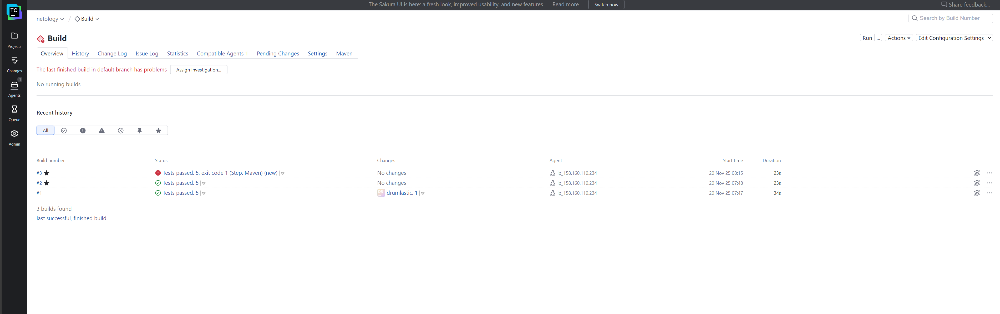
- В конфигурацию добавлен шаг `deploy`.
- Загружен корректный `settings.xml` в корень проекта.
- Тест не пройден

---

## 6. Ошибка сборки `clean deploy`
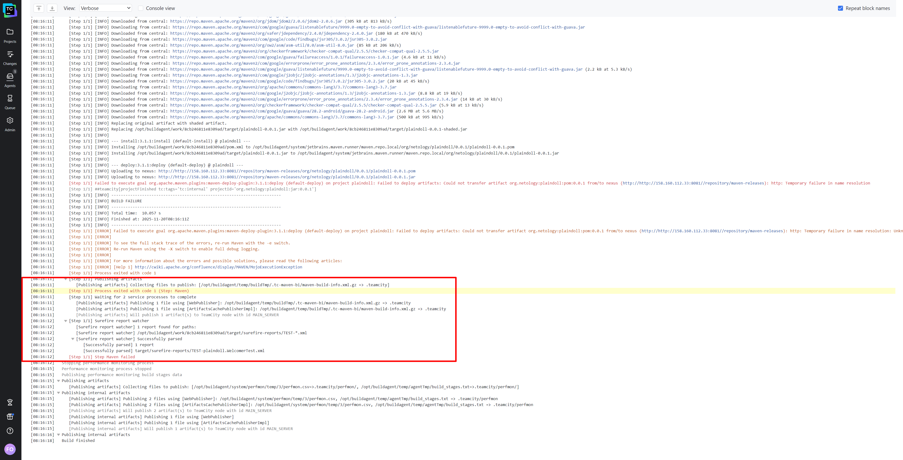
### Причина ошибки
Nexus **запрещает перезаписывать артефакты** в `maven-releases`, а версия в `pom.xml` была **одинаковой с уже существующей**.

### Решение
- Повышение версии в `pom.xml` → **0.0.3**.

---

## 7. Успешная сборка `clean deploy`
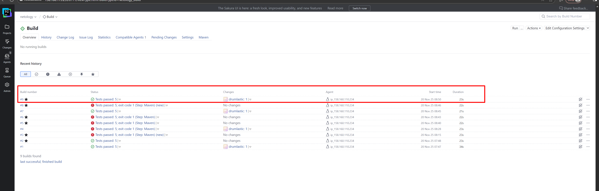
- После увеличения версии публикация прошла успешно.

---

## 8. Логи успешного деплоя
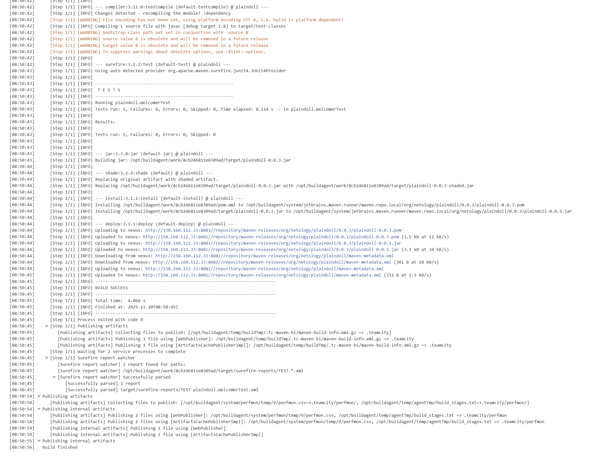
- Видно, что `.jar` и `.pom` успешно загружены в Nexus.

---

## 9. Артефакт приложения в Nexus
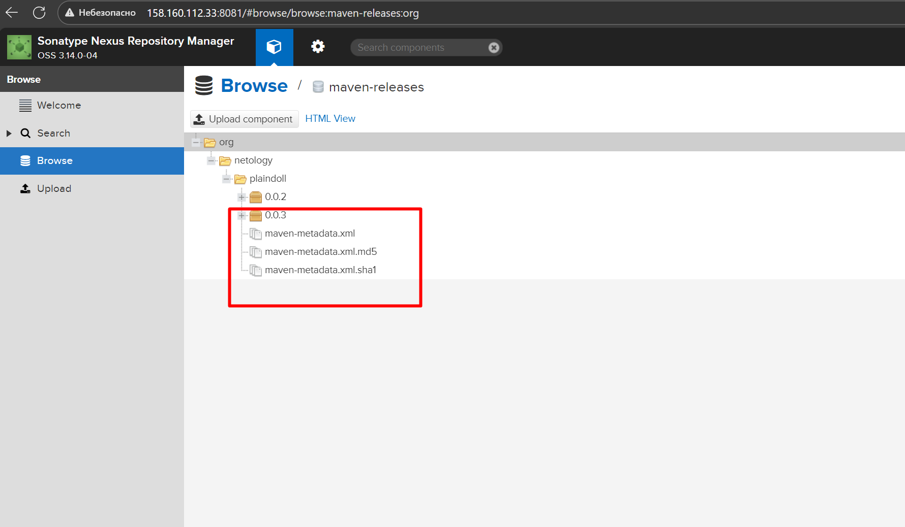
- Загружен `plaindoll-0.0.3.jar`.

---

## 10. Сборка ветки `feature/add_reply`
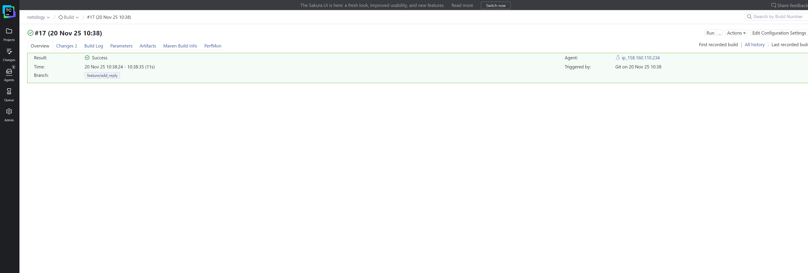
- Сборка триггерится автоматически при `push`.

---

## 11. Логи сборки ветки `feature/add_reply`
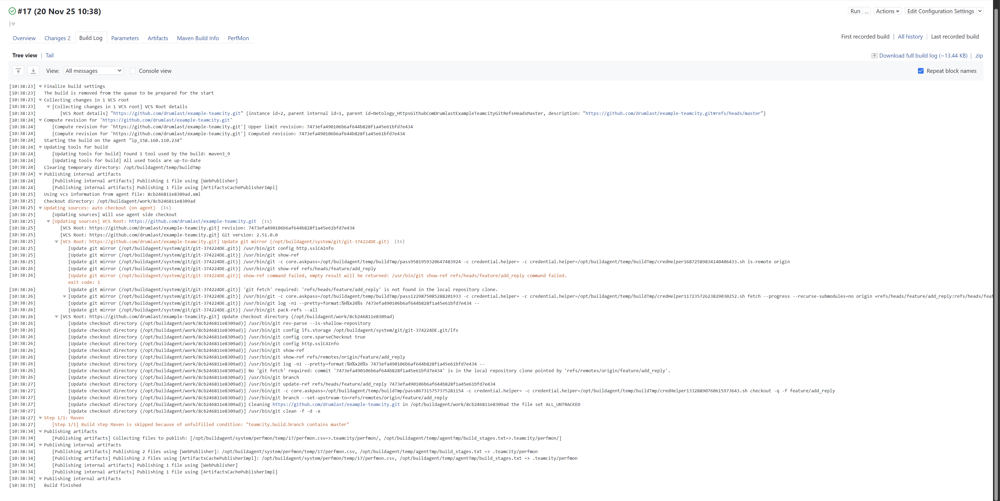
- Все тесты прошли.

---

## 12. Обновлённая сборка `master` после merge
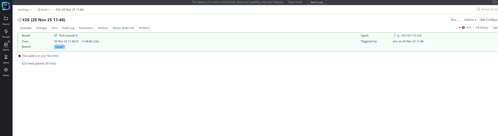
- После слияния ветки обновились тесты, и одно новое появилось.

---

## 13. Логи обновлённой сборки `master`
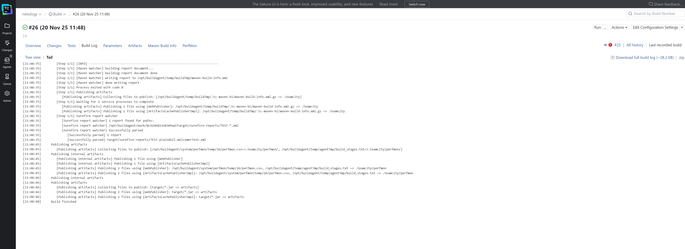
- 6 тестов успешно выполнены.

---

## 14. Создание артефактов в TeamCity
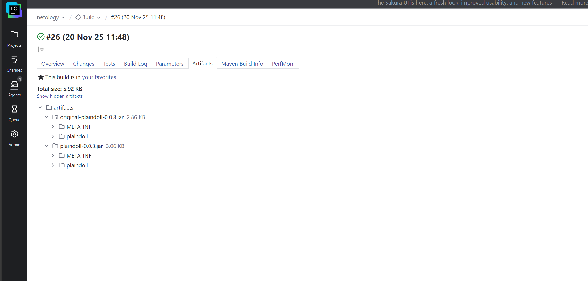
- Добавлены артефакты: оригинальный JAR и shaded JAR.

---

## 15. Артефакты в Nexus после финальной сборки
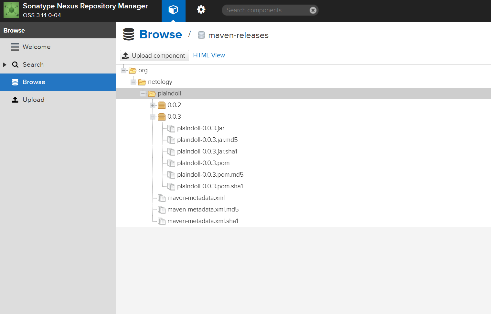
- Папка `0.0.3` содержит:
  - `.jar`, `.jar.md5`, `.jar.sha1`
  - `.pom`, `.pom.md5`, `.pom.sha1`
  - `maven-metadata.xml` и контрольные суммы

---

# Репозиторий с Ansible для Nexus
**https://github.com/drumlast/nexus-ansible**

Использовался для автоматической установки и настройки Nexus OSS.

---

# Итог
- Полностью настроена инфраструктура CI/CD.
- TeamCity выполняет тесты, собирает артефакты и публикует их в Nexus.
- Nexus корректно хранит версии и предотвращает перезапись релизов.
- Добавлен новый метод, тест, ветка feature, merge → master.
- Все этапы сопровождаются полным набором логов и скриншотов.

---

